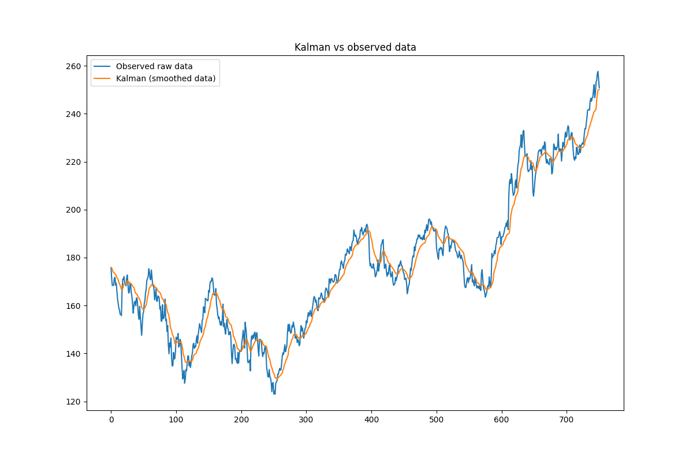
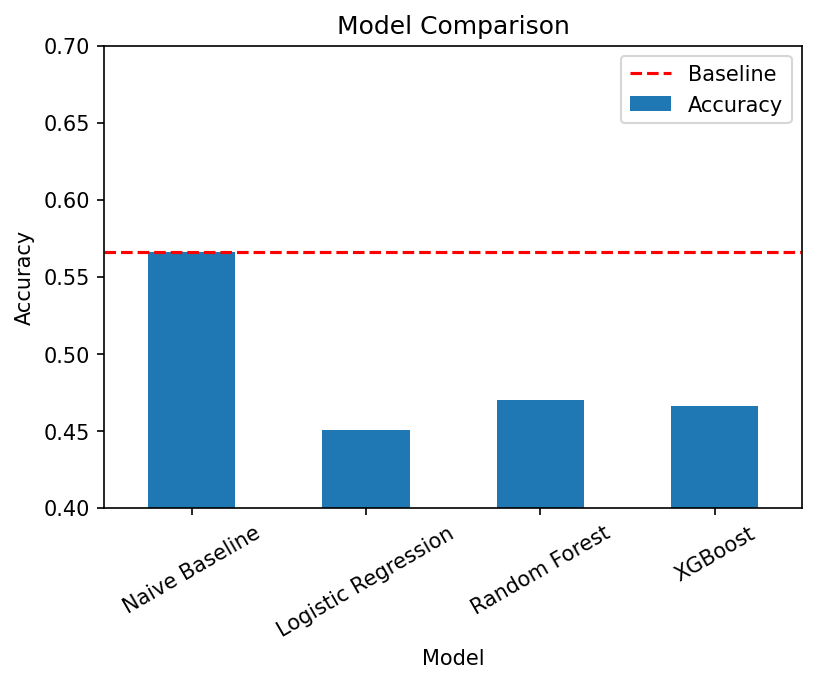
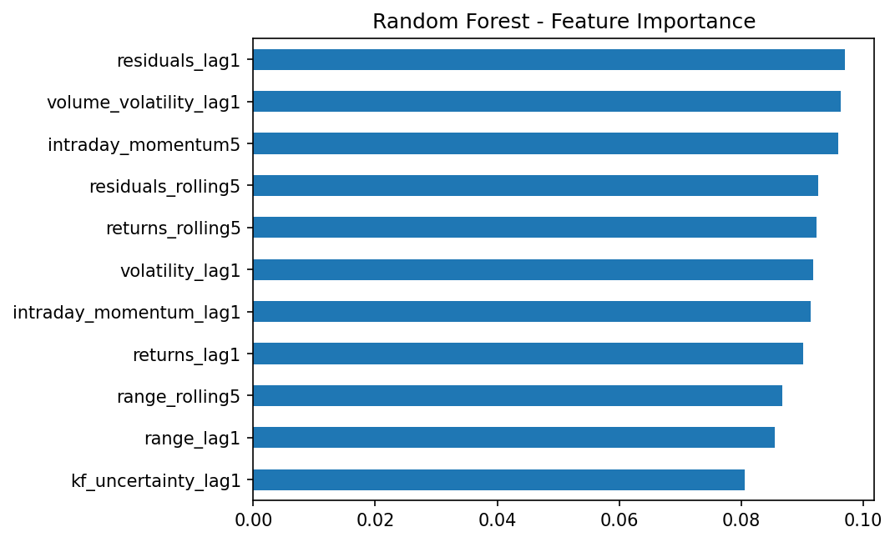

# Financial Time Series Smoothing and Prediction using Kalman Filter and ML

Financial time series are inherently noisy, making it difficult to extract meaningful trends from raw price data. In this project we apply Exploratory Data Analysis (EDA) for better understanding the dataset and making insights, Kalman Filter (KF) to smooth stock price data and estimate the underlying latent signal and Machine Learning (ML) models (Logistic Regression, Random Forest, XGBoost) in an attempt to predict the direction of future price movements. The dataset contains daily stock data for Apple Inc. (2022–2024), including price-based features such as close, high, low, and derived quantities like returns and volatility.

## Highlights

- KF with adaptive noise parameters (Q and R) based on market volatility
- Feature engineering for classification models included residuals from KF
- Quantitative verification of the weak form of the Efficient Market Hypothesis


## Project Structure

```
kalman-stock-analysis/
├── README.md
├── stock_data_analysis.ipynb                                # Full analysis notebook: EDA, KF, ML
├── [https://interactivestockdataanalysis.streamlit.app/]    # Interactive app with AI agent
├── app.py                                                   # streamlit code
├── requirements.txt                                         # Python libraries required to run streamlit code
└── assets/                                                  # Plots used in README.md
    ├── kalman_vs_raw.png
    ├── model_comparison.png
    └── feature_importance.png
```

## Installation and Usage

- Open `stock_data_analysis.ipynb` in Google Colab.
- Copy-paste streamlit link.
- pip install -r requirements.txt                     # if you want to run streamlit code

## Results
KF extracted latent signal from raw data, which include random noise. This was not sufficient for the ML models to effectively predict the direction of future price movements, confirming that technical features alone contain no exploitable structure. Finally, our models are consistent with the weak form of the Efficient Market Hypothesis.



## References
- [1] Welch, G., Bishop, G. (2006). An Introduction to the Kalman Filter.
- [2] Shumway, R.H., Stoffer, D.S. (1982). An approach to time series smoothing and forecasting using the EM algorithm.

## Author
Andreas Katsaounis — [andkatsa@hotmail.com]
